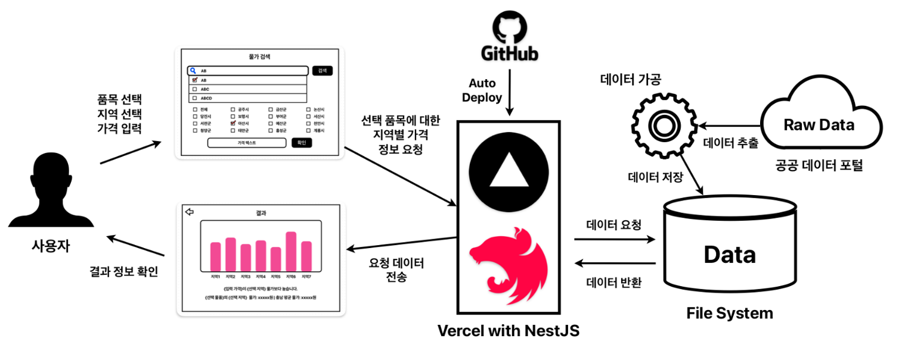

# 강원도 물가 API

## 소개

강원도 물가 검색 프로그램 중 가격 API 백엔드 부분입니다.

- [프론트엔드 부분 (JavaFX)](https://github.com/kgh5865/CompareRegionalPrices)
- [유저 인증 백엔드 부분 (ExpressJS)](https://github.com/jiseungmin/Price_Measurement_Project)

## 프로젝트 아키텍처



## 참여자

<table><tr>       
<td align="center"><a href="https://github.com/ICE0208">         <br /><strong>🛠️ ICE0208</strong></sub></a><br /><span>API 개발</span><br /></td>    
<td align="center"><a href="https://github.com/jiseungmin">         <br /><strong>⚙️ jiseungmin</strong></sub></a><br /><span>데이터 가공</span><br /></td>    
</tr>
</table><br />

## API DEMO

https://gangwon-price-api.vercel.app/api

<details>
<summary>(GET) /products</summary>

### 모든 상품명의 목록 얻기

#### curl

```bash
curl -X 'GET' \
  'https://gangwon-price-api.vercel.app/products' \
  -H 'accept: */*'
```

#### response

```json
{
  "ok": true,
  "data": {
    "_count": 92,
    "productNames": [
      "LPG (차량용 1L)",
      "PC방 (1시간)",
      "갈비탕 (수입 1인분)",
      ... 생략 ...
      "택시 (기본요금)",
      "하수도 (가정용 30톤㎥)"
    ]
  }
}
```

</details>
<details>
<summary>(GET) /prices</summary>

### 특정 상품의 지역별 가격을 얻기

#### params

- product (required) : 상품명

#### curl

```bash
curl -X 'GET' \
  'https://gangwon-price-api.vercel.app/prices?product=PC%EB%B0%A9%20%281%EC%8B%9C%EA%B0%84%29' \
  -H 'accept: */*'
```

#### response

```json
{
  "ok": true,
  "data": {
    "name": "PC방 (1시간)",
    "prices": {
      "강원도": 1420,
      "춘천시": 1090,
      "원주시": 1100,
      ... 생략 ...
      "고성군": 1400,
      "양양군": 1500
    }
  }
}
```

</details>

## 프로젝트 시연 영상

[🔗 시연 영상](https://github.com/ICE0208/gangwon-price-api/issues/7)
